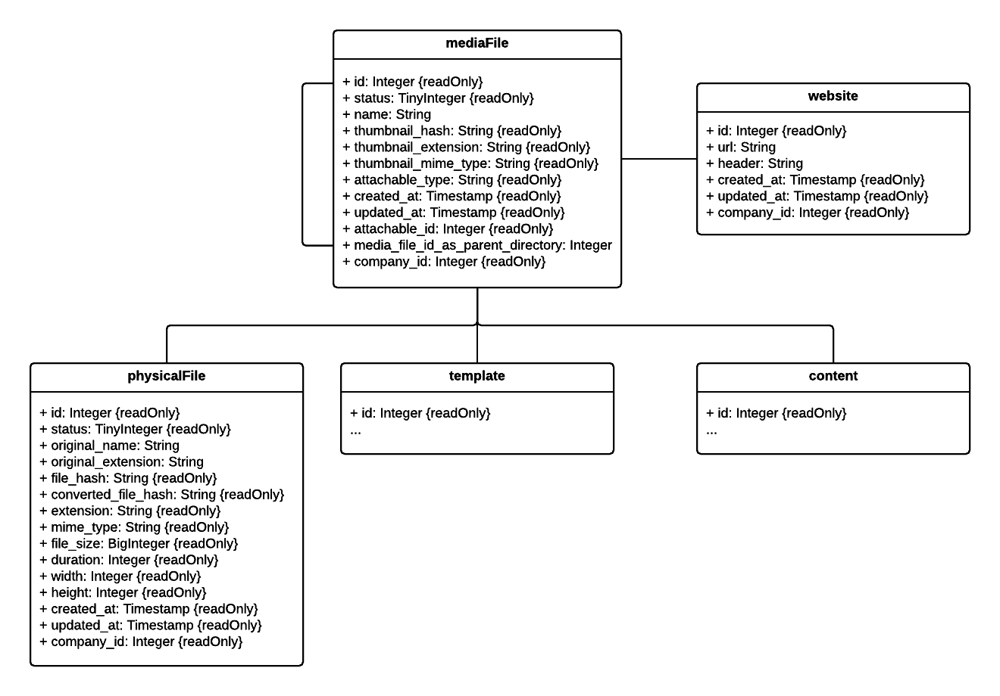

#MediaFile Model

- [MediaFile](#mediafile)
- [PhysicalFile](#physicalfile)

##MediaFile
###id: Integer {readOnly}
The id of the mediafile is set by the system.

###status: TinyInteger {readOnly}
Some mediafiles will be processed by the system. The status says what is currently happening with the mediafile.

| Value | Status |
| --- | --- |
| 0 | Waiting - Mediafile is waiting for some resources e.g. the file is still uploading. |
| 1 | Converting - The mediafile is currently converted by the system. |
| 2 | Error - The processing of the mediafile failed. |
| 3 | Converted - The conversion is completed. |

###name: String (Required)
The name should be a meaningful identifier for the mediafile.

###media_file_id_as_parent_directory: Integer
The id of the parent directory which can only be a mediafile without attachable. (Default NULL)

###thumbnail_hash: String {readOnly}
The hash of the thumbnail file.

>**Important:** Thumbnails are generated automatically by the system.

###thumbnail_extension: String {readOnly}
The file extension of the thumbnail. 

>**Important:** Thumbnails are generated automatically by the system.

###thumbnail_mime_type: String {readOnly}
The mime type of the mediafiles thumbnail.

>**Important:** Thumbnails are generated automatically by the system.

###attachable_type: String {readOnly}
Attachable types are set by the system depending on which data you provide the mediafile route ([More information](http://cloud.viewneo.com/doc/api#/MediaFile)).

Possible values and meanings are:

| Value | Meaning |
| --- | --- |
| NULL | Mediafile is a directory |
| Website | Mediafile is linked to a website |
| Template | Mediafile is linked to a template |
| PhysicalFile | Mediafile is linked to an uploaded physical file |

###created_at: Timestamp {readOnly}
Timestamp set by the system of when the mediafile was created.

###updated_at: Timestamp {readOnly}
Timestamp set by the system of when the mediafile was updated the last time.

###attachable_id: Integer {readOnly}
Id of the attached resource.

###media_file_id_as_parent_directory: Integer
Id of the directory where the mediafile should be stored.

###company_id: Integer {readOnly}
Id of the company that owns the mediafile. This value is set by the system.

##PhysicalFile
###id: Integer {readOnly}
The id of the physical file set by the system.

###status: TinyInteger {readOnly}
Some mediafiles will be processed by the system. The status says what is currently happening with the mediafile.

| Value | Status |
| --- | --- |
| 0 | Waiting - Physical file is waiting for some resources e.g. the file is still uploading. |
| 1 | Converting - The physical file is currently converted by the system. |
| 2 | Error - The processing of the physical file failed. |
| 3 | Converted - The conversion is completed. |

###original_name: String
The original name of the file is adopted by the uploaded file name.

###original_extension: String
The original name of the file is adopted by the uploaded file extension.

###file_hash: String {readOnly}
A hash created with the uploaded file.

###converted_file_hash: String {readOnly}
The file hash after it is converted.

###extension: String {readOnly}
The file extension after conversion.

###mime_type: String {readOnly}
Mime type of the uploaded file.

###file_size: BigInteger {readOnly}
Size of the physicle file in bytes.

###duration: Integer {readOnly}
Duration of the file (if it has one e.g. a video) in seconds.

###width: Integer {readOnly}
Width of the file in pixels.

###height: Integer {readOnly}
Height of the file in pixels.

###created_at: Timestamp {readOnly}
Timestamp set by the system of when the physical file was created.

###updated_at: Timestamp {readOnly}
Timestamp set by the system of when the physical file was updated last time.

###company_id: Integer {readOnly}
Id of the company that owns the physical file.
